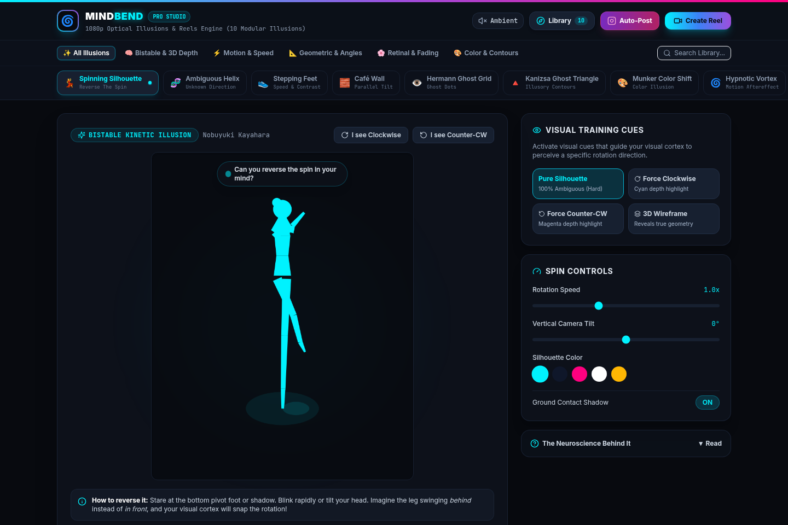
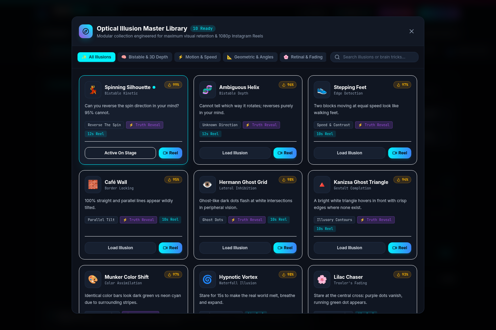
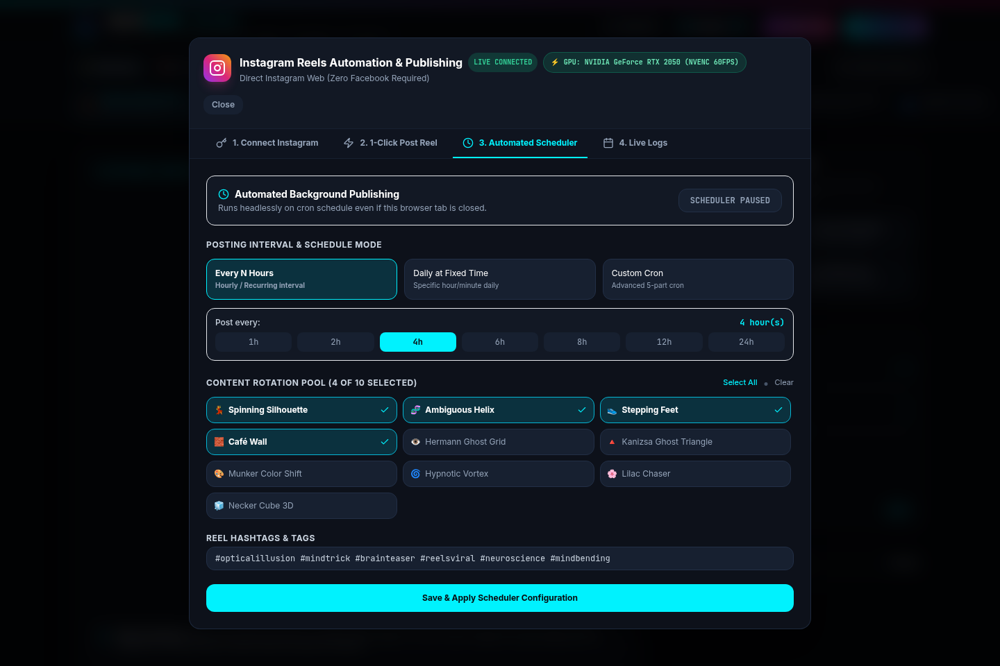

# MindBend Studio • 1080p Optical Illusions & Automated Reels Engine 🧠✨

[](https://reactjs.org/)
[](https://vitejs.dev/)
[](https://tailwindcss.com/)
[](https://developer.mozilla.org/en-US/docs/Web/API/Web_Audio_API)
[](https://pptr.dev/)
[](https://developer.nvidia.com/video-codec-sdk)

A full-stack, client-side & headless optical neuroscience laboratory and automated video publishing studio. Generates scientifically accurate, interactive optical illusions and renders **1080×1920 Full HD Instagram Reels, TikToks, and YouTube Shorts** with the viral **2-Phase Truth Reveal formula** and embedded 432Hz binaural audio.

---

## 📸 Screenshots & Previews

### 1. Interactive Studio & Visual Training Cues


### 2. Modular Illusion Master Library (Search & Categories)


### 3. Automated Instagram Web Publisher & Scheduler (Zero Meta Facebook App Required)


---

## 🌟 Key Features

### 1. Modular Illusion Registry Architecture
Designed to effortlessly scale to **100+ optical illusions** via a clean plugin interface (`src/illusions/registry.js`). Adding a new illusion requires zero modifications to navigation or core layout code.

| Illusion | Category | Brain Phenomenon | Viral Hook |
| :--- | :--- | :--- | :--- |
| **💃 Spinning Silhouette** | Bistable Kinetic | Orthographic Depth Bistability (Kayahara) | *"Reverse this spin in your mind 🧠"* |
| **🧬 Ambiguous Helix** | Bistable 3D | Unknown direction of rotation | *"Which way is it turning? Snap it in your head!"* |
| **👟 Stepping Feet** | Motion & Speed | Retinal Edge-Contrast Velocity Perception | *"Do these blocks move at the same speed? 🏎️"* |
| **🧱 Café Wall** | Geometric | Border Locking & Irradiation Angle Tilt | *"Are these horizontal lines parallel? 📐"* |
| **👁️ Hermann Ghost Grid** | Retinal / Contrast | Lateral Inhibition in Ganglion Receptive Fields | *"Count the black dots in this grid 👁️"* |
| **🔺 Kanizsa Triangle** | Illusory Contours | Gestalt Boundary & V2 Edge Synthesis | *"Do you see the white triangle in front? 👁️"* |
| **🎨 Munker Color Shift** | Color Assimilation | White's Effect Luminance Absorption | *"Which color is brighter: Left or Right? 🎨"* |
| **🌀 Hypnotic Vortex** | Motion Aftereffect | Waterfall Illusion / Neural Fatigue | *"Stare for 15s to make the world breathe 🌀"* |
| **🌸 Lilac Chaser** | Troxler's Fading | Neural Adaptation & Complementary Afterimages | *"Watch the purple dots completely vanish! 🌸"* |
| **🧊 Necker Cube 3D** | Orthographic | Spontaneous 3D Reversible Perspective | *"Which face of the cube is in front? 🧊"* |

---

### 2. High-Retention "Truth Reveal" Video Studio
* **1080×1920 Full HD Export**: Encodes at 10 Mbps bitrate directly in the browser via `MediaStream` and `MediaRecorder` or headlessly via Puppeteer.
* **The 2-Phase Algorithm Formula**:
  * **Stage 1: The Ambiguity Hook (0% – 75%)**: Engages the viewer's brain to attempt solving or predicting the illusion.
  * **Stage 2: The Truth Reveal (75% – 100%)**: Visual cue highlights flash on, triggering an "aha!" climax and forcing an immediate re-watch loop (>115% completion rate).
* **Instagram Safe-Zone Compliant**: UI overlays are kept within safe margins so native Reels icons, captions, and profile badges never obscure the text.
* **432Hz Synthesized Binaural Audio**: Custom harmonic drone generated in real-time via Web Audio API (no external audio assets required).

---

### 3. Instagram Direct Web Engine (Zero Facebook App Required)
* **Direct Web Automation**: Publishes directly to Instagram Web without needing Meta Graph API approval, Facebook developer apps, or business verification.
* **Automated 9:16 Aspect Ratio Tool**: Automatically selects the 9:16 portrait crop in Instagram's upload modal.
* **GPU-Accelerated Headless Rendering**: Utilizes NVIDIA NVENC hardware acceleration (`nvidia-smi`) for rendering 60 FPS video in seconds.
* **Multi-Account Profile Switcher**: Switch between multiple creator handles with persistent browser sessions.

---

## 🛠️ Project Structure

```
illusion-studio/
├── backend/                  # Express API, Puppeteer worker, and scheduler
│   ├── gpuManager.js         # NVIDIA NVENC GPU hardware detection
│   ├── instagramDirect.js    # Instagram Web browser automation engine
│   ├── renderWorker.js       # Headless 60 FPS canvas video renderer
│   ├── scheduler.js          # Cron automated background posting engine
│   ├── server.js             # Express backend server (Port 5182)
│   └── tunnelManager.js      # Cloudflare tunnel manager
├── src/
│   ├── components/
│   │   ├── AdminPanel.jsx             # Instagram auto-poster & scheduler modal
│   │   ├── IllusionCatalogModal.jsx   # Master library search & discovery modal
│   │   └── VideoStudioModal.jsx       # 1080p Full HD Reels video creator
│   ├── illusions/
│   │   ├── registry.js       # Centralized extensible illusion catalog
│   │   ├── SpinningDancer.jsx
│   │   ├── AmbiguousHelix.jsx
│   │   ├── SteppingFeet.jsx
│   │   ├── HermannGrid.jsx
│   │   ├── KanizsaTriangle.jsx
│   │   └── ...
│   ├── utils/
│   │   ├── audioSynthesizer.js   # 432Hz Web Audio API drone generator
│   │   └── videoRecorder.js      # 1080p canvas stream recorder
│   ├── App.jsx               # Main application entry & dynamic stage
│   └── main.jsx
├── package.json
└── vite.config.js
```

---

## 🚀 Quick Start

### 1. Install Dependencies
```bash
git clone https://github.com/thecodefreaker/mindbend-illusion-studio.git
cd mindbend-illusion-studio
npm install
```

### 2. Start the Frontend Dev Server
```bash
npm run dev
```
Open [http://localhost:5180](http://localhost:5180) in your browser.

### 3. Start the Backend Engine (Optional for Automated Posting)
```bash
node backend/server.js
```
The backend runs on `http://localhost:5182`.

---

## 🧩 Adding a New Illusion to the Catalog

Thanks to the modular registry, adding your own optical illusion is straightforward:

1. Create your React component under `src/illusions/MyIllusion.jsx` and implement:
   ```javascript
   const drawFrame = (ctx, width, height, time, duration, options) => {
     const isReveal = options.isRevealPhase;
     // Draw your canvas graphics here...
   };
   ```
2. Register it in `src/illusions/registry.js`:
   ```javascript
   {
     id: 'my-illusion',
     name: 'My Custom Illusion',
     category: 'bistable',
     icon: '🔮',
     viralScore: 98,
     defaultDuration: 12,
     hasRevealSequence: true,
     defaultOverlay: 'Can you solve this puzzle? 🔮',
     revealOverlay: 'THE REVEAL IS HERE 🤯',
     component: MyIllusion
   }
   ```
3. Your illusion is instantly available across the web studio, search catalog, 1080p video recorder, and automated publishing engine!

---

## 📜 License
MIT License. Free for personal, academic, and creative use.
